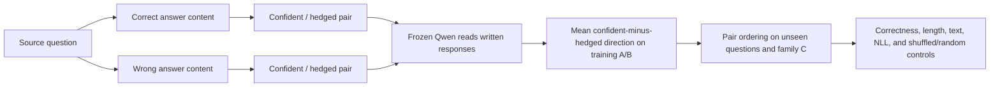

# Paired Confidence Pilot v1

This pilot tests a candidate readout of **expressed certainty** while fixing the
answer content. It follows the paired-rewrite suggestion in the meeting handoff.
The ordinary SDT objective specifies the target content; a future internal term
would need separate validation. This pilot leaves Qwen frozen.



Read the [preregistration](PAIRED_CONFIDENCE_PREREGISTRATION_V1.md),
[current status](PAIRED_CONFIDENCE_STATUS.md), and
[results report](PAIRED_CONFIDENCE_RESULTS_V1.md).

## Execution

Run from this worktree. The existing environment and pinned model snapshot are
referenced through `runtime.shared_repo` in each YAML, so neither is copied.
The checked-in source/variant JSONL files are the exact analysis inputs. Building
them again requires the referenced SQuAD cache and pinned MMLU parquet.

```bash
# Data audit only
../semantic-entropy-probes-stage0/.venv/bin/python scripts/run_paired_confidence_pilot.py \
  --config configs/paired_confidence_phase_a.yaml --mode audit

# Four-source boundary, finite-state, prefix-invariance, and resume checks
../semantic-entropy-probes-stage0/.venv/bin/python scripts/run_paired_confidence_pilot.py \
  --config configs/paired_confidence_phase_a.yaml --mode sanity

# Full Phase A; individual activations are cached immediately
../semantic-entropy-probes-stage0/.venv/bin/python scripts/run_paired_confidence_pilot.py \
  --config configs/paired_confidence_phase_a.yaml --mode run

# Phase B fails closed unless the matching Phase A gates have passed
../semantic-entropy-probes-stage0/.venv/bin/python scripts/run_paired_confidence_pilot.py \
  --config configs/paired_confidence_phase_b.yaml --mode run
```

Primary representation: layer 14 after the assistant `<|im_end|>` boundary token,
ID 151645. Secondary positions exclude that token: final response-content token
and mean over response-content tokens. Layer 23 boundary is exploratory.
The source-specific right-padded shape is fixed across all its variants, including
unseen family-C text for tensor shape only; it never enters readout fitting.

Each phase saves exact extraction metadata, hidden vectors, readout directions,
row scores, source-level bootstrap metrics, null distributions, audit gates,
plots, and a manifest with hashes. Resumable inference files and model weights
stay under ignored `cache/`; aggregate artifacts are checked in.

A high score means the written response has been represented as more assertive
under this paired construct. It does not certify correctness, evidence,
subjective confidence, causality, or usefulness during SDT.
