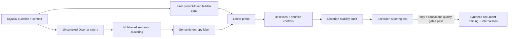
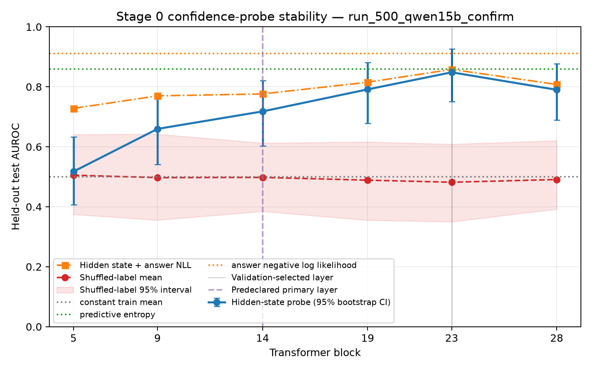
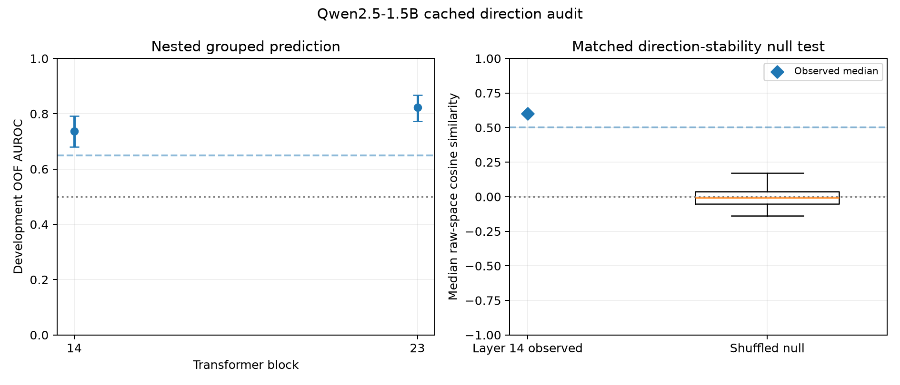

# Semantic Entropy Probes: Stage 0 Validation

**Original work:** Kossen et al., [*Semantic Entropy Probes: Robust and Cheap Hallucination Detection in LLMs*](https://arxiv.org/abs/2406.15927) · [Official OATML GitHub repository](https://github.com/OATML/semantic-entropy-probes)

This repository is a small-scale validation study adapted from the official implementation. It tests whether the method produces a reliable enough internal signal to support the next experiment; it is not a full replication of the paper.

## Conclusion

> **Project decision: continue to a controlled activation-steering experiment. Do not begin mechanistic-loss training yet.**

### What “Stage 0” means

Stage 0 is the **feasibility and measurement stage** that comes before causal intervention or model training. It asks three questions:

1. Can sampled answers provide a usable measure of semantic uncertainty?
2. Can a simple linear probe read that uncertainty from the model's hidden state on unseen questions?
3. Is the learned direction stable enough to justify an intervention test?

Passing Stage 0 supports **Stage 1: activation steering**. It does not by itself support **Stage 2: adding an internal loss during synthetic-document training**.

### What we did

- Reproduced the Semantic Entropy Probes pipeline with **Qwen2.5-1.5B**.
- Ran a fresh, non-overlapping set of **500 SQuAD questions**, with **10 sampled answers per question**.
- Computed semantic entropy, cached final-prompt-token activations, trained linear probes, and compared them with output-based uncertainty baselines.
- Audited whether the learned layer-14 direction remained consistent across independent grouped data splits.

### What we found

- **The internal uncertainty signal is detectable.** The preregistered layer-14 probe reached test AUROC **0.718 [0.603, 0.821]**.
- **The layer-14 direction is reproducible.** Nested cross-validation AUROC was **0.738 [0.680, 0.793]**; independently fitted directions had median cosine similarity **0.600**, above the shuffled-label upper bound of **0.123**.
- **The probe is not better than answer likelihood.** Answer negative log-likelihood remained the stronger predictor, and adding the probe did not improve it.
- **The 1.5B model should be retained.** The 0.5B model validated the code path but produced weaker and frequently truncated answers.

### What Stage 0 confirms

**There is a stable, testable internal direction associated with sampled semantic uncertainty.** This is enough evidence to proceed to a causal intervention experiment.

### What Stage 0 does not confirm

**It does not show that this direction controls uncertainty.** It therefore does not yet justify using the direction as an internal loss during synthetic-document training.

### Connection to the proposed study

| Research stage | Main question | Status |
|---|---|---|
| **Stage 0: measurement** | Can uncertainty be measured and read out from a reproducible internal direction? | **Completed** |
| **Stage 1: intervention** | Does bidirectional activation steering change uncertainty without harming answer quality? | **Next** |
| **Stage 2: training** | Can the validated direction guide normal synthetic-document training through an auxiliary loss? | **Conditional on Stage 1** |

This is a pipeline-validation study, not a paper-level replication or evidence of mechanistic causality.

## Method at a glance



## How the probe was built

**In one sentence:** the probe tests whether the 1,536 values in one pre-generation hidden state can linearly distinguish questions with low versus high sampled semantic entropy.

1. **Generate multiple answers.** For each of 500 fresh SQuAD questions, Qwen2.5-1.5B generated 10 short answers with temperature 1.0. Repeated sampling reveals whether the model consistently gives the same meaning or produces competing answers.

2. **Group answers by meaning.** The local NLI model compared each pair of answers in both directions, with the question included as context. Two answers entered the same cluster only when they matched after normalization or both NLI directions predicted entailment. This is stricter than grouping by wording alone.

3. **Compute the uncertainty target.** If cluster \(c\) contains a fraction \(p_c\) of the 10 answers, cluster-assignment semantic entropy is

   $$
   H_{\mathrm{sem}}=-\sum_c p_c\log p_c.
   $$

   Low entropy means that sampled answers concentrate on one meaning. High entropy means that they split across several meanings. This is an **operational proxy for uncertainty**, not direct access to the model's true confidence. The pilot follows the upstream probe notebook by using cluster-assignment entropy as the target rather than a likelihood-weighted entropy variant.

4. **Create labels without test leakage.** Questions were split by SQuAD context into 307 training, 94 validation, and 99 test examples, so questions sharing a context could not cross splits. Using only the training entropies, the pipeline selected the cutoff that best separated them into two compact groups; the confirmatory cutoff was **0.98996**. Questions at or above the cutoff were labelled high entropy. The test set remained untouched until evaluation.

5. **Extract one internal representation per question.** Before generating an answer, the pipeline saved the hidden vector at the **final token of the complete prompt**. For Qwen2.5-1.5B, each vector has 1,536 values. The primary analysis used transformer layer 14, fixed before the fresh 500-question run.

6. **Train the linear probe.** Each hidden-state dimension was standardized using training data only. Logistic regression then learned

   $$
   s=w^Tz+b, \qquad P(\text{high entropy})=\sigma(s),
   $$

   where \(z\) is the standardized layer-14 hidden vector. The probe therefore learns the simplest linear boundary between low- and high-entropy questions; it does not update Qwen itself.

7. **Evaluate on unseen questions and controls.** Probe scores were evaluated with AUROC on the locked test set and context-level bootstrap intervals. Comparisons included a constant predictor, predictive entropy, answer negative log-likelihood, and probes trained on shuffled labels.

8. **Recover the candidate intervention direction.** The fitted weight vector was converted from standardized coordinates back to the model's raw hidden-state coordinates and normalized. Moving in the positive direction is associated with higher semantic entropy; moving in the negative direction is associated with lower semantic entropy. Stage 0 tests whether this direction is reproducible. Stage 1 must test whether manipulating it actually causes uncertainty to change.

## Confirmatory result

The primary result uses 500 questions that do not overlap the earlier 200-question experiment by ID, context, exact question, or near-duplicate question. Each question has 10 sampled answers. The context-grouped split contains 307 training, 94 validation, and 99 test questions.

| Method | Test AUROC | 95% interval |
|---|---:|---:|
| Constant baseline | 0.500 | — |
| Preregistered layer 14 | **0.718** | **[0.603, 0.821]** |
| Validation-selected layer 23 | 0.848 | [0.751, 0.927] |
| Predictive entropy | 0.859 | [0.783, 0.922] |
| Answer negative log-likelihood | **0.911** | **[0.851, 0.958]** |
| Layer 14 + answer NLL | 0.776 | — |

AUROC is 0.5 at chance and 1.0 for perfect ranking. Layer 14 exceeds both chance and the shuffled-label 95% upper bound of 0.613. Its combination with answer NLL underperforms NLL alone by 0.135 AUROC; the paired interval is [-0.226, -0.050].



## Direction-stability gate

This follow-up used only the locked 401-example development pool. The previously reported 99-example test split was not fitted or scored.

| Diagnostic | Layer 14 result | Gate |
|---|---:|---:|
| Repeated nested-CV OOF AUROC | 0.738 [0.680, 0.793] | Passed |
| Disjoint-half raw-direction cosine | 0.600 median [0.347, 0.717] | Passed |
| Shuffled-null median-cosine upper 95% | 0.123 | Passed |
| Common-holdout score correlation | 0.900 median | Passed |
| NLL-minus-combined log-loss | -0.0027 [-0.0052, -0.0010] | Failed incremental-value gate |



## Experimental progression

| Phase | Purpose | Main outcome |
|---|---|---|
| 0.5B smoke and pilot | Validate the pipeline | Engineering checks passed; probe evidence was weak |
| Matched 1.5B run, 200 questions | Improve answer quality | Layer 14 test AUROC 0.665; interval crossed chance |
| Cached split audit | Test partition sensitivity | Fixed layer 14 cross-fitted AUROC 0.588 [0.507, 0.666] |
| Sampling audit, 50 questions | Test label reliability | 5-vs-20 agreement 84%; 10-vs-20 agreement 90% |
| Fresh 1.5B confirmation, 500 questions | Confirm the internal signal | Layer 14 passed; incremental-information gate failed |
| Cached direction audit, 401 development questions | Test whether one intervention direction is reproducible | Direction gate passed; corrected incremental gate failed |

## Interpretation

| Supported by Stage 0 | Not established |
|---|---|
| End-to-end reproduction of the probe pipeline | Paper-level replication |
| A predictive layer-14 uncertainty association | A proof that the feature causes confidence |
| A direction reproducible across grouped data splits | Incremental information beyond answer likelihood |
| Proceeding to a small activation-steering diagnostic | Synthetic-document mechanistic-loss training |
| Continuing with Qwen2.5-1.5B rather than 0.5B | SDT, biological, tamper-resistance, or safety claims |

## Reproduce

Requirements: Python 3.11 and [`uv`](https://docs.astral.sh/uv/).

```bash
uv venv --python 3.11 .venv
uv pip install --python .venv/bin/python -r requirements-stage0.txt

.venv/bin/python scripts/run_stage0.py \
  --config configs/stage0_qwen15b_500_confirm.yaml \
  --run run_500_qwen15b_confirm

.venv/bin/python scripts/run_direction_stability.py \
  --config configs/stage0_qwen15b_direction_stability.yaml
```

Per-example caches under `cache/` are resumable and intentionally excluded from Git. Checked-in aggregate artifacts are under `results/`. Detailed setup and execution notes are in [`README_STAGE0.md`](README_STAGE0.md).

## Repository guide

- [`RESULTS_STAGE0.md`](RESULTS_STAGE0.md) — canonical evidence report; all quantitative conclusions live here
- [`README_STAGE0.md`](README_STAGE0.md) — reproducibility commands and artifact definitions only
- [`STATUS.md`](STATUS.md) — one-screen current state and next decision gate
- [`results/README.md`](results/README.md) — result-directory index
- [`configs/`](configs/) — frozen experiment configurations
- [`stage0/`](stage0/) — Stage 0 generation, clustering, probe, and stability code
- [`scripts/`](scripts/) — command-line entry points
- [`semantic_entropy_probes/`](semantic_entropy_probes/) — preserved upstream probe notebook snapshot, not the main local pipeline
- [`semantic_uncertainty/`](semantic_uncertainty/) — upstream semantic-uncertainty support code retained for provenance
- [`docs/UPSTREAM_README.md`](docs/UPSTREAM_README.md) — preserved upstream documentation

## Important deviations

- Generator size is 0.5B or 1.5B rather than the larger models studied in the paper.
- The upstream `microsoft/deberta-v2-xlarge-mnli` judge is replaced with the smaller `cross-encoder/nli-deberta-v3-small`.
- Only selected layers and the final prompt token are tested.

See [`RESULTS_STAGE0.md`](RESULTS_STAGE0.md) for the complete deviation and failure analysis.

The preserved upstream snapshot is pinned to commit `02e2167dd1c00e27080d421f9b40e13e00f0452b`, and its MIT license is retained.
