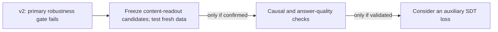

# Measurement Studies Before an Internal SDT Loss

**Transfer v2 is complete: the frozen readout transfers to new certainty wording
and shows a pooled association with supplied evidence, but fails its registered
fact-type robustness gate. The boundary readout is not ready for an SDT loss.**

The primary direction was unchanged from Paired Confidence v1. V2 tested 48 fresh
fictional facts, with identical neutral answer tokens across evidence conditions.
This is the v1 **post-response expressed-certainty direction**, not the Stage 0
prompt-state semantic-uncertainty probe.

| Required endpoint | Ordering | Source-bootstrap 95% interval |
|---|---:|---:|
| New confident/hedged wording | 87/96 (90.6%) | 81.3–97.9% |
| Neutral QA: supported > omitted evidence | 35/48 (72.9%) | 60.4–85.4% |
| Independent raw-likelihood manipulation check | 48/48 (100%) | Saturated empirical interval |

Both pooled readout scores exceed their thresholds, but release-year evidence
ordering is **4/12 (33.3%)**, below chance. The preregistration required no fact
type below chance. The evidence manipulation passed, so this is a completed
robustness failure, not absence of a pooled signal or an inconclusive manipulation.
See the [v2 results](CONFIDENCE_TRANSFER_RESULTS_V2.md).

The research aim is ordinary synthetic-document training (SDT) plus a possible
auxiliary internal-confidence loss that preserves answer accuracy. Before that
term can guide training, we need to know whether it measures support for an
answer rather than rewarding assertive wording. Transfer is one prerequisite;
causal effects and held-out accuracy/calibration still need separate validation.

## Next decision

The separately frozen layer-14 final-content and response-mean readouts reached
93.8% evidence ordering; their wording scores were 86.5% and 100%, respectively.
They are candidates for **prospective confirmation on fresh data**, not substitutes
for the failed primary endpoint. Fix the candidate positions and decision rules
before testing new facts, field names, and same-proposition wording controls.

Removing the single v1 correctness direction reduced primary evidence ordering
to 50%; that ablation does not prove independence or a confidence mechanism.
Strong individual null directions also remain possible. No subjective-confidence,
calibration, causal-control, or training-loss claim is established.

## Research sequence

Stage 0 and Stage 0B are this project's measurement-stage names, not stages
defined by the original paper. These studies do not use one interchangeable
“confidence probe”; their targets and token positions differ.

| Canonical name | Primary token position | Target / comparison | Conclusion |
|---|---|---|---|
| [Stage 0 — Prompt-State Semantic-Uncertainty Probe](RESULTS_STAGE0.md#outcome) | Final rendered prompt token, before the answer | Semantic entropy of sampled future answers | Reproducible association; no improvement over answer likelihood. |
| [Stage 0B — Answer-State Semantic-Uncertainty Diagnostic](RESULTS_STAGE0.md#stage-0b--post-answer-hidden-state-diagnostic) | Final ordinary token of one observed answer | Semantic entropy of nine alternative answers | No reliable incremental gain over the same answer's likelihood. |
| [Paired Confidence v1 — Answer-End Expressed-Certainty Readout](PAIRED_CONFIDENCE_RESULTS_V1.md) | Post-response `<\|im_end\|>` token | Confident versus hedged wording with answer content fixed | Candidate expressed-certainty direction; shared phrasing shifts and broad nulls limit interpretation. |
| [Frozen Transfer v2 — Expressed-Certainty Evidence-Transfer Test](CONFIDENCE_TRANSFER_RESULTS_V2.md) | Same post-response `<\|im_end\|>` token | Frozen v1 ordering on new wording and identical answers under different evidence | Pooled transfer association; required fact-type gate fails. |

Only v1 → v2 reuses the same fitted direction. The
[experiment map](EXPERIMENT_MAP.md) gives the precise naming, data and equations,
including a short explanation of how Paired Confidence v1 was calculated.

## Evidence and reproduction

- [Current status](STATUS.md) — completed result and next decision
- [Experiment map and canonical names](EXPERIMENT_MAP.md) — targets, token positions, data and v1 calculation
- [V2 results](CONFIDENCE_TRANSFER_RESULTS_V2.md), [preregistration](CONFIDENCE_TRANSFER_PREREGISTRATION_V2.md), and [execution runbook](CONFIDENCE_TRANSFER_README_V2.md)
- [V1 results](PAIRED_CONFIDENCE_RESULTS_V1.md), [preregistration](PAIRED_CONFIDENCE_PREREGISTRATION_V1.md), and [execution](PAIRED_CONFIDENCE_README.md)
- [Stage 0/0B report](RESULTS_STAGE0.md) and [technical runbook](README_STAGE0.md) — historical findings preserved
- [Artifact index](results/README.md) and [documentation/provenance](docs/README.md)

This small-scale Qwen study adapts Kossen et al.'s
[*Semantic Entropy Probes*](https://arxiv.org/abs/2406.15927) and
[official OATML implementation](https://github.com/OATML/semantic-entropy-probes);
it is not a full paper replication. The preserved upstream snapshot is commit
`02e2167dd1c00e27080d421f9b40e13e00f0452b`, with its MIT license retained.
