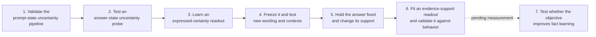

# Mechanistic Confidence for Synthetic Fact Learning

**A linear readout reliably distinguishes confident from hedged wording in
Qwen 1.5B on controlled authored responses. It has not been validated as an
evidence-sensitive measure of confidence in a particular answer.**

In the strongest test, we held an answer's text and token positions fixed while
changing whether the context supported or contradicted it. Two frozen readouts
ranked confident wording above hedged wording in every tested pair, but ranked
the identical answer higher in its supporting context only **52.1% and 51.0%**
of the time. Both failed the registered confirmation checks.

**The next step is to validate the measurement before using it as a training
loss.** Evidence-Sensitive Readout v4 is in progress: it fits a new linear
readout to answer support, then tests fresh records, unfamiliar wording and
the model's own answer choices. The synthetic-fact training proposal is
deferred until this measurement work is assessed. No auxiliary-loss training
or causal intervention has been run here.

The long-term project asks whether ordinary SDT can be augmented with an
internal objective that helps a model learn target facts more reliably:

```math
\mathcal L_{\mathrm{total}}
=
\mathcal L_{\mathrm{SDT}}
+
\lambda\mathcal L_{\mathrm{internal}}.
```

[Latest report](reports/CONFIDENCE_SEPARATION_RESULTS_V3.md) ·
[Questions and answers](datasets/README.md) ·
[Method](docs/experiments/EXPERIMENT_MAP.md) ·
[Current experiment](docs/experiments/EVIDENCE_CONFIDENCE_README_V4.md)

## Research sequence

The historical experiment names remain in files and artifacts for
reproducibility. They form seven consecutive research steps:

| Step | Study | Question | Result | Evidence | Status |
|---:|---|---|---|---|---|
| 1 | Stage 0 | Can a prompt state predict disagreement among future sampled answers? | Partly, but answer likelihood was stronger | [Report](reports/RESULTS_STAGE0.md#outcome) · [Data](datasets/stage0/README.md) | Complete |
| 2 | Stage 0B | Does an observed answer state predict disagreement among alternative answers? | Partly, with no gain beyond likelihood | [Report](reports/RESULTS_STAGE0.md#stage-0b--post-answer-hidden-state-diagnostic) · [Data](datasets/stage0/README.md) | Complete |
| 3 | Paired Confidence v1 | Can a linear direction distinguish confident from hedged wording? | Yes on the controlled held-out set | [Report](reports/PAIRED_CONFIDENCE_RESULTS_V1.md) · [Data](datasets/paired-confidence-v1/README.md) | Complete |
| 4 | Frozen Transfer v2 | Does the frozen direction transfer to new wording and evidence contexts? | Wording transferred; evidence robustness failed for one fact type | [Report](reports/CONFIDENCE_TRANSFER_RESULTS_V2.md) · [Data](datasets/frozen-transfer-v2/README.md) | Complete |
| 5 | Separation v3 | With the answer fixed, does the readout track whether context supports it? | The primary readouts scored 52.1% and 51.0% | [Report](reports/CONFIDENCE_SEPARATION_RESULTS_V3.md) · [Data](datasets/confidence-separation-v3/README.md) | Complete |
| 6 | Evidence-Sensitive Readout v4 | Can a new support readout transfer across facts and wording, and agree with model behavior? | Results pending | [Design](docs/experiments/EVIDENCE_CONFIDENCE_V4_PREREGISTRATION.md) · [Runbook](docs/experiments/EVIDENCE_CONFIDENCE_README_V4.md) | In progress |
| 7 | Synthetic-fact training pilot | Does a candidate objective improve recall and retention beyond matched controls? | Not yet tested | [Proposal](docs/experiments/NEXT_EXPERIMENT.md) | Deferred pending measurement |



Steps 1–3 estimate different readouts with different labels and token positions.
Only the v1 certainty directions from Step 3 are reused in Steps 4 and 5.

## How the certainty readout works

We first reproduced a small version of the
[Semantic Entropy Probes pipeline](https://arxiv.org/abs/2406.15927) to establish
generation, uncertainty labels, state extraction and evaluation. We then
studied a different target: expressed certainty in matched confident and hedged
answers. All certainty studies used supplied responses that Qwen read through
a forward pass; they did not label confidence in its own generated answers.

The readout averages paired hidden-state differences on training sources,
normalizes the resulting direction, and scores a new state by its dot product
with that fixed direction. Each token position has its own fitted direction;
the [method](docs/experiments/EXPERIMENT_MAP.md#calculation) gives the equations
and source-grouped splits.

## Step 5: the decisive comparison

We authored **48 new fictional records and 672 responses**. For example:

| | Supporting world | Contradicting world |
|---|---|---|
| Supplied fact | The depot's entry code is 4712. | The depot's entry code is 8635. |
| Identical response | The entry code is 4712. | The entry code is 4712. |

Both candidate values were tested. Answer tokens, response positions and prompt
lengths matched across worlds. The layer-14 directions were fitted on earlier
training data and frozen before this new test.

| Method | Confident > hedged | Same answer: supported > contradicted |
|---|---:|---:|
| Final ordinary response-token readout | **100.0%** | **52.1% [44.8, 59.4]** |
| Mean of response-content states | **100.0%** | **51.0% [47.9, 54.2]** |
| Answer likelihood | 43.2% | **100.0%** |

These are **paired score-ordering rates**, not generated-answer accuracy.
Intervals resample the 48 base records together with all their variants.
Likelihood confirms that the context change is detectable in this sample;
its perfect ordering is not evidence of perfectly calibrated confidence.

The response-mean score also rose when relevant context was present **and
contradicted the answer**: 80.2% versus 81.3% for supporting context, each
compared with omitted information. This post-hoc check suggests sensitivity to
relevant information being present, although context wording remains a possible
contributor. See the [full report and figure](reports/CONFIDENCE_SEPARATION_RESULTS_V3.md).

## Current conclusion

- **Expressed certainty is decodable in these controlled tasks.** The samples
  use a limited set of authored wording families; lexical and template cues
  remain possible, and the score does not establish the model's own belief.
  In v1, 12/200 shuffled directions also reached 100%; the
  [controls](reports/PAIRED_CONFIDENCE_RESULTS_V1.md#outcomes-and-controls)
  do not identify a unique certainty mechanism.
- **The current readouts lack reliable answer-support sensitivity.** This
  constrains their factual-confidence interpretation; it does not settle their
  usefulness as a training objective or rule out other confidence readouts.
- **Vector angles do not establish independent mechanisms.** Nearly
  perpendicular certainty and correctness contrasts can still detect the same
  wording. The [cached audit](reports/CONFIDENCE_CORRECTNESS_AUDIT.md) checks this
  without treating the estimated correctness direction as a complete truth axis.

## Step 6: validate an evidence-sensitive measurement

V4 uses **168 new fictional records**, split into 96 training, 24 validation
and 48 untouched test records. It supplies the same neutral answer under
supporting, omitted and contradicting evidence. It fits only on training
support-versus-contradiction pairs, with one fixed layer and regularization.
Test records and context/question/answer templates are all held out.

The test asks whether scores follow **supported > omitted > contradicted**,
including answers phrased confidently or tentatively. Independent question
paraphrases also elicit 144 short answers from the frozen model and score both
candidate answers. Agreement with that behavior is necessary for the intended
interpretation; support classification alone would be insufficient.

The [registered design](docs/experiments/EVIDENCE_CONFIDENCE_V4_PREREGISTRATION.md)
fixes the controls and pass criteria. The [v4 report](reports/EVIDENCE_CONFIDENCE_RESULTS_V4.md)
currently records the study status; no v4 numerical result is claimed yet.
Even a passing pilot would require broader tests of ambiguous evidence and
generated answers before describing the score as validated confidence.

## Step 7: deferred training study

Run a small **synthetic-fact SFT pilot** with four matched conditions: ordinary
SFT, SFT plus the frozen readout loss, random-direction controls, and an
output-only control that adds weight to target-answer tokens. Test new phrasings
of the trained facts and retention after the same interference step in all
groups. Judge improvement independently of the optimized readout score.

This first pilot would use completed-answer states, matching the current
readout. Transfer to ordinary document training would need separate testing.
The [earlier proposal](docs/experiments/NEXT_EXPERIMENT.md) preserves the
controls and decisions to fix before training. It is deferred while v4 tests
the measurement and remains a proposal rather than a completed experiment.

The [experiment map](docs/experiments/EXPERIMENT_MAP.md) gives the exact token
positions, data splits and equations. The [code map](code/README.md) provides
reproduction entry points; [project status](docs/experiments/STATUS.md) records
the current decision. The supplementary
[correctness and geometry audit](reports/CONFIDENCE_CORRECTNESS_AUDIT.md)
reuses data from Steps 3 and 4.

## Repository layout

| Folder | Purpose |
|---|---|
| [datasets/](datasets/README.md) | Readable questions, answers and CSV downloads |
| [data/](data/README.md) | Exact machine-readable source inputs and data audits |
| [reports/](reports/README.md) | Research findings and interpretation |
| [code/](code/README.md) | Code map and entry points for reproducing each experiment |
| [docs/](docs/README.md) | Methods, execution instructions and provenance |
| [results/](results/README.md) | Saved numerical outputs, states, readouts and manifests |
| [plots/](plots/) | Research figures |
| [configs/](configs/) | Experiment settings |

The code map points to `stage0/`, `confidence_pilot/` and `scripts/`. Their paths
are retained so existing commands and cached-artifact checks remain valid.
The two root preregistrations retain their original content and published paths.

## Sources

This work adapts Kossen et al.'s [*Semantic Entropy Probes*](https://arxiv.org/abs/2406.15927)
and [official OATML code](https://github.com/OATML/semantic-entropy-probes).
The upstream snapshot and MIT license are preserved; the small-model experiments
and paired-response studies are not a full paper replication.
