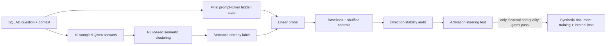

# Semantic Entropy Probes: Stage 0 Validation

## Conclusion

**Project decision: continue to a controlled activation-steering study, but do not begin mechanistic-loss training yet.**

Stage 0 establishes two prerequisites for the proposed mechanistic-confidence study. First, sampled semantic entropy is measurable and linearly decodable from Qwen2.5-1.5B activations under the present protocol. Second, the resulting layer-14 probe direction is reproducible across grouped data splits. On a fresh 500-question SQuAD dataset, the preregistered probe reached AUROC **0.718 [0.603, 0.821]** on the locked 99-question test split. In a separate nested cross-validation audit, its out-of-fold AUROC was **0.738 [0.680, 0.793]**, and independently trained directions had median cosine similarity **0.600**, compared with a shuffled-label upper bound of **0.123**.

What remains unresolved is causality. The internal signal is weaker than answer likelihood, and a strictly nested model combining answer negative log-likelihood with the probe score performed slightly worse than answer likelihood alone. Stage 0 therefore identifies a defensible intervention target; it does not show that changing this activation changes uncertainty.

The next experiment should manipulate the frozen layer-14 direction in both directions. If this changes semantic entropy as predicted, exceeds random, shuffled, and temperature-matched controls, and preserves answer quality, the direction becomes a defensible candidate for an auxiliary internal loss during otherwise standard synthetic-document training. If it fails, the proposed mechanistic loss should not proceed in its current form.

The 0.5B model was sufficient to validate the pipeline but produced weak and frequently truncated answers. Qwen2.5-1.5B is the appropriate model for the next experiment.

This is a pipeline-validation study rather than a paper-level replication.

## Connection to the proposed study

| Research stage | Question | Decision |
|---|---|---|
| Stage 0: measurement and readout | Is there a sufficiently reliable uncertainty label and a reproducible internal direction? | **Yes, for an intervention test** |
| Stage 1: causal intervention | Does moving the model along that direction change semantic entropy without damaging answer quality? | **Next experiment** |
| Stage 2: synthetic-document training | Can the direction serve as an auxiliary internal loss during normal training? | **Conditional on Stage 1** |

## Method overview



The probe is a standardized logistic regression trained to classify high versus low sampled semantic entropy from the final prompt-token activation. Its weight vector defines the candidate intervention direction.

## Confirmatory result

The primary result uses 500 questions that do not overlap the earlier 200-question experiment by ID, context, exact question, or near-duplicate question. Each question has 10 sampled answers. The context-grouped split contains 307 training, 94 validation, and 99 test questions.

| Method | Test AUROC | 95% interval |
|---|---:|---:|
| Constant baseline | 0.500 | — |
| Preregistered layer 14 | **0.718** | **[0.603, 0.821]** |
| Validation-selected layer 23 | 0.848 | [0.751, 0.927] |
| Predictive entropy | 0.859 | [0.783, 0.922] |
| Answer negative log-likelihood | **0.911** | **[0.851, 0.958]** |
| Layer 14 + answer NLL | 0.776 | — |

AUROC is 0.5 at chance and 1.0 for perfect ranking. Layer 14 exceeds both chance and the shuffled-label 95% upper bound of 0.613. Its combination with answer NLL underperforms NLL alone by 0.135 AUROC; the paired interval is [-0.226, -0.050].


## Direction-stability gate

This follow-up used only the locked 401-example development pool. The previously reported 99-example test split was not fitted or scored.

| Diagnostic | Layer 14 result | Gate |
|---|---:|---:|
| Repeated nested-CV OOF AUROC | 0.738 [0.680, 0.793] | Passed |
| Disjoint-half raw-direction cosine | 0.600 median [0.347, 0.717] | Passed |
| Shuffled-null median-cosine upper 95% | 0.123 | Passed |
| Common-holdout score correlation | 0.900 median | Passed |
| NLL-minus-combined log-loss | -0.0027 [-0.0052, -0.0010] | Failed incremental-value gate |


## Experimental progression

| Phase | Purpose | Main outcome |
|---|---|---|
| 0.5B smoke and pilot | Validate the pipeline | Engineering checks passed; probe evidence was weak |
| Matched 1.5B run, 200 questions | Improve answer quality | Layer 14 test AUROC 0.665; interval crossed chance |
| Cached split audit | Test partition sensitivity | Fixed layer 14 cross-fitted AUROC 0.588 [0.507, 0.666] |
| Sampling audit, 50 questions | Test label reliability | 5-vs-20 agreement 84%; 10-vs-20 agreement 90% |
| Fresh 1.5B confirmation, 500 questions | Confirm the internal signal | Layer 14 passed; incremental-information gate failed |
| Cached direction audit, 401 development questions | Test whether one intervention direction is reproducible | Direction gate passed; corrected incremental gate failed |

## Interpretation

| Supported by Stage 0 | Not established |
|---|---|
| End-to-end reproduction of the probe pipeline | Paper-level replication |
| A predictive layer-14 uncertainty association | A proof that the feature causes confidence |
| A direction reproducible across grouped data splits | Incremental information beyond answer likelihood |
| Proceeding to a small activation-steering diagnostic | Synthetic-document mechanistic-loss training |
| Continuing with Qwen2.5-1.5B rather than 0.5B | SDT, biological, tamper-resistance, or safety claims |

## Reproduce

Requirements: Python 3.11 and [`uv`](https://docs.astral.sh/uv/).

```bash
uv venv --python 3.11 .venv
uv pip install --python .venv/bin/python -r requirements-stage0.txt

.venv/bin/python scripts/run_stage0.py \
  --config configs/stage0_qwen15b_500_confirm.yaml \
  --run run_500_qwen15b_confirm

.venv/bin/python scripts/run_direction_stability.py \
  --config configs/stage0_qwen15b_direction_stability.yaml
```

Per-example caches under `cache/` are resumable and intentionally excluded from Git. Checked-in aggregate artifacts are under `results/`. Detailed setup and execution notes are in [`README_STAGE0.md`](README_STAGE0.md).

## Repository guide

- [`RESULTS_STAGE0.md`](RESULTS_STAGE0.md) — canonical evidence report; all quantitative conclusions live here
- [`README_STAGE0.md`](README_STAGE0.md) — reproducibility commands and artifact definitions only
- [`STATUS.md`](STATUS.md) — one-screen current state and next decision gate
- [`results/README.md`](results/README.md) — result-directory index
- [`configs/`](configs/) — frozen experiment configurations
- [`stage0/`](stage0/) — Stage 0 generation, clustering, probe, and stability code
- [`scripts/`](scripts/) — command-line entry points
- [`semantic_entropy_probes/`](semantic_entropy_probes/) — preserved upstream probe notebook snapshot, not the main local pipeline
- [`semantic_uncertainty/`](semantic_uncertainty/) — upstream semantic-uncertainty support code retained for provenance
- [`docs/UPSTREAM_README.md`](docs/UPSTREAM_README.md) — preserved upstream documentation

## Important deviations

- Generator size is 0.5B or 1.5B rather than the larger models studied in the paper.
- The upstream `microsoft/deberta-v2-xlarge-mnli` judge is replaced with the smaller `cross-encoder/nli-deberta-v3-small`.
- Only selected layers and the final prompt token are tested.

See [`RESULTS_STAGE0.md`](RESULTS_STAGE0.md) for the complete deviation and failure analysis.

## Provenance

Based on Kossen et al., [*Semantic Entropy Probes: Robust and Cheap Hallucination Detection in LLMs*](https://arxiv.org/abs/2406.15927), and the [OATML reference implementation](https://github.com/OATML/semantic-entropy-probes) at commit `02e2167dd1c00e27080d421f9b40e13e00f0452b`. The upstream MIT license is retained.
