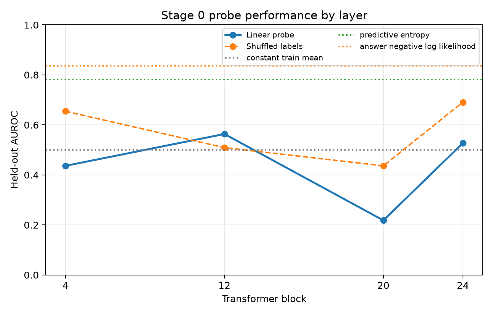

# Semantic Entropy Probes — Resource-Efficient Stage 0

An Apple-Silicon reproduction of the core **Semantic Entropy Probes (SEP)** pipeline, designed to answer one narrow question: can the published workflow be made local, reproducible, and inexpensive enough for a first mechanistic-confidence validation?

> **Executive takeaway:** the pipeline works end to end, but this pilot does **not** yet show a reliable hidden-state probe. Output likelihood baselines outperform the tested activation probes, so the correct next step is a larger stability run—not a mechanistic or causal claim.

## Experiment at a glance

| Component | Stage 0 choice |
|---|---|
| Hardware | Apple M3 MacBook Air, 16 GB RAM |
| Generator | `Qwen/Qwen2.5-0.5B-Instruct`, unquantized FP16 on MPS |
| Dataset | Fixed answerable subset of SQuAD v2 validation |
| Semantic grouping | Local `cross-encoder/nli-deberta-v3-small` |
| Samples | 64 questions × 5 generations in the meaningful pilot |
| Hidden state | Final prompt token before generation |
| Layers | 4, 12, 20, 24 |
| Probe | Standardized logistic regression |
| External services | None: no OpenAI API, W&B, or remote judge |

The five-example preflight, 12-example smoke test, and 64-example meaningful pilot all passed their engineering checks. Generations, token log probabilities, semantic labels, entailment decisions, and hidden states are cached locally and the checked-in results are reproducible from one YAML configuration.

## Main result

The held-out test set contains only 16 examples, so the numbers below are diagnostic rather than paper-level evidence.

| Method | Best/tested result (AUROC) |
|---|---:|
| Hidden-state probe, best layer (12) | **0.564** |
| Constant baseline | 0.500 |
| Predictive entropy | **0.782** |
| Answer negative log-likelihood | **0.836** |



The target was non-degenerate: the 64 examples produced 1–5 semantic clusters and seven distinct entropy values. However, shuffled-label probes were unstable and sometimes stronger than the true-label probes. This is consistent with small-sample variance and high-dimensional overfitting, not evidence of a robust activation signal.

## What was validated

- local MPS generation and CPU fallback logic;
- arbitrary Hugging Face model IDs in the adapted loader;
- extraction of the intended final-prompt-token activation;
- resumable per-example generation and hidden-state caches;
- local bidirectional NLI clustering with cached judgments;
- semantic-entropy and output-uncertainty computation;
- leakage-aware linear probing and shuffled-label controls;
- train/test audits for duplicate IDs, questions, contexts, and near-duplicate questions;
- local artifacts and plots without W&B.

## What was **not** established

This repository does not support claims about SDT, biological knowledge, tamper resistance, confidence-loss effectiveness, or mechanistic causality. Qwen 0.5B also produced many incomplete or incorrect 12-token answers, which may add label noise. See [RESULTS_STAGE0.md](RESULTS_STAGE0.md) for the complete failure analysis.

## Recommendation

Run one 200-example Qwen 0.5B stability experiment with layers 4, 8, 12, 16, 20, and 24 and a fixed train/validation/test split. Move to Qwen 1.5B only if the larger 0.5B experiment remains near chance or answer-quality review identifies model capacity as the dominant limitation.

## Reproduce locally

Requirements: Python 3.11 and approximately 3 GB of free disk beyond the repository.

```bash
uv venv --python 3.11 .venv
uv pip install --python .venv/bin/python -r requirements-stage0.txt

.venv/bin/python scripts/run_stage0.py \
  --config configs/stage0_qwen05b.yaml \
  --run preflight

.venv/bin/python scripts/run_stage0.py \
  --config configs/stage0_qwen05b.yaml \
  --run run_a

.venv/bin/python scripts/run_stage0.py \
  --config configs/stage0_qwen05b.yaml \
  --run run_b
```

The model and inference caches are intentionally excluded from Git. Checked-in result artifacts are under `results/`.

## Repository guide

- [RESULTS_STAGE0.md](RESULTS_STAGE0.md) — complete configuration, metrics, deviations, and recommendation
- [README_STAGE0.md](README_STAGE0.md) — implementation and execution details
- [MACHINE_ASSESSMENT.md](MACHINE_ASSESSMENT.md) — measured local environment and resource assessment
- [PLAN_STAGE0.md](PLAN_STAGE0.md) — staged experimental plan
- [STATUS.md](STATUS.md) — current state and next action
- [`configs/stage0_qwen05b.yaml`](configs/stage0_qwen05b.yaml) — canonical configuration
- [`stage0/pipeline.py`](stage0/pipeline.py) — local cached pipeline
- [`results/run_b/`](results/run_b/) — meaningful-run artifacts
- [`docs/UPSTREAM_README.md`](docs/UPSTREAM_README.md) — preserved upstream documentation

## Provenance

This work is based on:

- Kossen et al., [*Semantic Entropy Probes: Robust and Cheap Hallucination Detection in LLMs*](https://arxiv.org/abs/2406.15927)
- OATML, [`semantic-entropy-probes`](https://github.com/OATML/semantic-entropy-probes), inspected at commit `02e2167dd1c00e27080d421f9b40e13e00f0452b`

The original MIT license is retained. Stage 0 deviations—especially the 0.5B generator, smaller NLI model, sample size, and token/layer subset—are documented explicitly in the results report.
