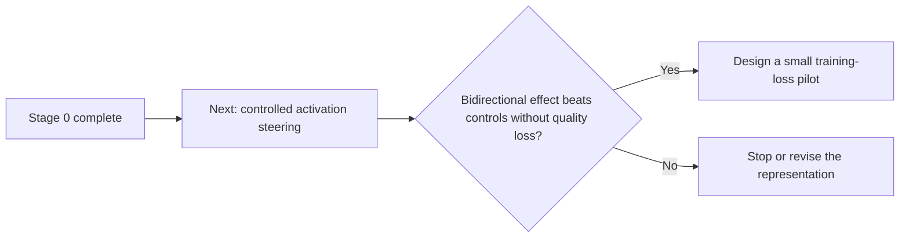

# Project Status

Last updated: 2026-09-29

## Current state

| Question | Answer |
|---|---|
| Is the local pipeline validated? | **Yes** |
| Is the layer-14 direction stable enough for an intervention test? | **Yes** |
| Is a mechanistic-confidence training loss justified? | **No** |

## Immediate experiment

1. Verify the layer-14 hook against cached activations and require `alpha = 0` to reproduce baseline logits.
2. Compare negative-direction, positive-direction, zero-hook, matched random, shuffled-direction, and matched-temperature conditions.
3. Measure semantic entropy, exact match/F1, wrong consensus, output length, and degeneration.

The canonical quantitative record is [`RESULTS_STAGE0.md`](RESULTS_STAGE0.md). Reproduction commands are in [`README_STAGE0.md`](README_STAGE0.md), and artifacts are indexed in [`results/README.md`](results/README.md).
