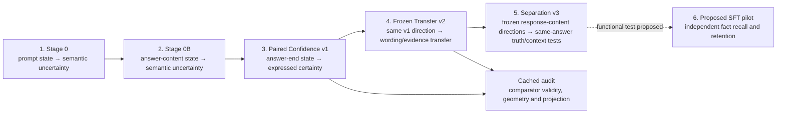

# Research Sequence and Methods

These experiments do **not** share one target, token position, or fitted
direction. To avoid calling several different measurements “the confidence
probe,” this repository uses the following names.

| Step | Canonical name | What is predicted or compared? | Hidden state used | Data used to fit the readout |
|---:|---|---|---|---|
| 1 | **Stage 0 — Prompt-State Semantic-Uncertainty Probe** | Whether multiple future sampled answers have high or low semantic entropy | Layer 14 at the **final rendered prompt token, before any answer** | SQuAD questions; semantic-entropy labels made from locally generated answer samples |
| 2 | **Stage 0B — Answer-State Semantic-Uncertainty Diagnostic** | Whether nine alternative answers have high or low semantic entropy after one answer is observed | Layer 14 at the **final ordinary token of the observed answer** | The same cached 500-question SQuAD run; answer 0 supplies the state and answers 1–9 supply the label |
| 3 | **Paired Confidence v1 — Answer-End Expressed-Certainty Readout** | Whether a fixed written response is phrased confidently or with a hedge | Layer 14 at the assistant **`<\|im_end\|>` token after the complete response** | Paired confident/hedged rewrites from SQuAD, arithmetic/logic and selected MMLU sources |
| 4 | **Frozen Transfer v2 — Expressed-Certainty Evidence-Transfer Test** | Whether the unchanged v1 readout transfers to new wording and to identical answers with versus without target evidence | The same layer-14 **post-response `<\|im_end\|>` token** | **No v2 fitting.** The direction is frozen from Paired Confidence v1 |
| 5 | **Confidence–Correctness Separation v3** | Whether identical answers score higher when correct under counterfactual contexts; wording and omitted-role controls | Frozen v1 layer-14 **final response-content token** and **response-content mean**; end marker as reference | **No v3 fitting.** Confidence vectors are unchanged; comparator contrasts use only old v1 train/A-B sources |
| 6 | **Proposed synthetic-fact training pilot** | Whether a candidate internal objective improves recall and retention | Completed-answer states, to be fixed before preregistration | No training has been run |

Use the full names at first mention. Short forms are `Stage 0`, `Stage 0B`,
`Paired Confidence v1`, `Frozen Transfer v2`, and `Separation v3`. In particular:

- Stage 0 and Stage 0B are **semantic-uncertainty** experiments.
- Paired Confidence v1 is an **expressed-certainty** experiment.
- Frozen Transfer v2 tests **wording transfer and supplied-context
  sensitivity**; it does not create a new probe.
- Separation v3 holds answer text fixed while its contextual correctness changes.
- The cached confidence/correctness audit is supplementary post-hoc analysis of
  existing v1/v2 caches, not another independently confirmed experiment.
- None of these experiments directly labels subjective confidence or proves
  a causal confidence mechanism.

Paired Confidence v1 also has internal **Phase A** and **Phase B** scale-up
steps. Those are parts of v1 and must not be confused with the separate project
experiment named **Stage 0B**.

## How Paired Confidence v1 was built

### Data

Phase B contains 120 source questions: 40 cached SQuAD questions, 40
mechanically checked arithmetic/logic questions, and 40 selected MMLU questions.
The grouped split is 72 training, 24 validation, and 24 test sources. All
variants of one source remain in one split.

Each source has three rewrite families (A/B/C). Within each family, the same
source produces four cells:

```text
correct + confident     correct + hedged
wrong   + confident     wrong   + hedged
```

This gives 12 responses per source and 1,440 responses overall. Confident and
hedged versions preserve the answer proposition; therefore v1 can be tested
separately on correct and deliberately wrong content. Families A/B from the 72
training sources fit the direction: 576 response rows forming 288
confident/hedged differences. Family C is excluded from fitting. The primary
held-out endpoint uses family C on the 24 unseen test sources: 48 pairs, one
correct-content pair and one wrong-content pair per source.

### Calculation

Qwen is frozen and reads each complete written response in teacher-forcing mode.
Let $h^{\mathrm{confident}}_{qkf}$ and
$h^{\mathrm{hedged}}_{qkf}$ be the layer-14 states at the response-end
`<|im_end|>` token for source $q$, correctness cell $k$, and training
rewrite family $f\in\{A,B\}$. First compute the paired difference:

$$
d_{qkf}=h^{\mathrm{confident}}_{qkf}-h^{\mathrm{hedged}}_{qkf}.
$$

Average the four A/B × correct/wrong differences within each training source,
then average the 72 sources equally and normalize:

$$
\bar d_q=\operatorname{mean}_{k,f}d_{qkf},\qquad
v=\frac{\operatorname{mean}_q\bar d_q}
        {\left\|\operatorname{mean}_q\bar d_q\right\|_2}.
$$

A new response receives the raw score

$$
s(h)=v^\top h.
$$

Here $v^\top h$ is a dot product, not a calibrated probability. V1 counts a
pair as correct when the confident version has the higher score. It does not
fit a threshold, scaler, logistic regression, or dimension selector for this
primary direction.

V1 ordered all 48 held-out family-C test pairs correctly, including both
correct and wrong answer content. The measured target is **expressed certainty**.
Twelve of 200 source-sign-shuffled directions also reached 100%, and the TF-IDF
control tied on 42 of 48 pairs. Those controls do not establish a unique direction
or removal of lexical cues. The [v1 report](../../reports/PAIRED_CONFIDENCE_RESULTS_V1.md)
records all checks, including content review by research agents and rules rather
than human annotation.

V3 constrains the interpretation as evidence-sensitive factual confidence.
Whether the readout is a useful additional training objective is a separate,
untested question: ordinary SFT already supplies the target content. See the
[proposed functional comparison](NEXT_EXPERIMENT.md).

## Relationship between the experiments



The arrows show the research sequence, not reuse of one fitted vector. Stage 0,
Stage 0B and Paired Confidence v1 each estimate a different readout. Only Paired
Confidence v1 supplies the frozen, position-specific directions for v2 and v3.
The cached audit estimates correctness contrasts solely on old v1 training data.
It never fits them on v2/v3 outcomes.

See the [Stage 0/0B report](../../reports/RESULTS_STAGE0.md),
[Paired Confidence v1 report](../../reports/PAIRED_CONFIDENCE_RESULTS_V1.md), and
[Frozen Transfer v2 report](../../reports/CONFIDENCE_TRANSFER_RESULTS_V2.md),
[fresh v3 report](../../reports/CONFIDENCE_SEPARATION_RESULTS_V3.md), and
[cached audit](../../reports/CONFIDENCE_CORRECTNESS_AUDIT.md) for results and
limitations.

The dashed arrow is a proposal, not an experiment that has been run.
