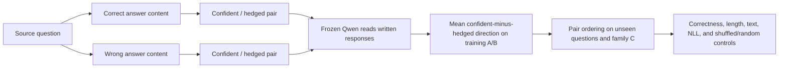

# Paired Confidence v1 — Answer-End Expressed-Certainty Readout

This pilot tests a candidate readout of **expressed certainty** while fixing the
answer content. It follows the paired-rewrite suggestion in the meeting handoff.
The ordinary SDT objective specifies the target content; a future internal term
would need separate validation. This pilot leaves Qwen frozen.

## Method in brief

This is **not** the Stage 0 semantic-uncertainty probe. Stage 0 uses the final
rendered prompt token before generation. Paired Confidence v1 estimates a new
direction and instead reads layer 14 at the assistant `<|im_end|>` token after
the full written response. Its internal Phase A/B scale-up steps are not the
separate project experiment named Stage 0B.

Phase B uses 120 source questions: 40 cached SQuAD, 40 arithmetic/logic, and 40
selected MMLU. Sources are grouped into 72 train, 24 validation, and 24 test.
Every source has three rewrite families and, within each family, correct/wrong
answer content × confident/hedged wording. This produces 1,440 responses.

For every training source, take the hidden-state difference between each
confident response and its same-proposition hedged partner. Average the four
A/B-family × correct/wrong differences within the source, average the 72
training sources equally, and normalize the resulting vector:

\[
v=\operatorname{normalize}\!\left(
\operatorname{mean}_q\operatorname{mean}_{k,f\in\{A,B\}}
(h^{\mathrm{confident}}_{qkf}-h^{\mathrm{hedged}}_{qkf})
\right),\qquad s(h)=v^\top h.
\]

The fitted pool contains 576 A/B training responses and 288 paired differences.
Family C never fits the direction. The primary evaluation uses 48 family-C
pairs from 24 unseen test sources: one correct-content and one wrong-content
pair per source. A higher score only means “more aligned with the v1
expressed-certainty direction”; it is not a probability or a correctness label.
See the [experiment map](EXPERIMENT_MAP.md) for the four canonical study names.



Read the [preregistration](../../PAIRED_CONFIDENCE_PREREGISTRATION_V1.md),
[current status](PAIRED_CONFIDENCE_STATUS.md), and
[results report](../../reports/PAIRED_CONFIDENCE_RESULTS_V1.md).

## Execution

Run from this worktree. The existing environment and pinned model snapshot are
referenced through `runtime.shared_repo` in each YAML, so neither is copied.
The checked-in source/variant JSONL files are the exact analysis inputs. Building
them again requires the referenced SQuAD cache and pinned MMLU parquet.

```bash
# Data audit only
../semantic-entropy-probes-stage0/.venv/bin/python scripts/run_paired_confidence_pilot.py \
  --config configs/paired_confidence_phase_a.yaml --mode audit

# Four-source boundary, finite-state, prefix-invariance, and resume checks
../semantic-entropy-probes-stage0/.venv/bin/python scripts/run_paired_confidence_pilot.py \
  --config configs/paired_confidence_phase_a.yaml --mode sanity

# Full Phase A; individual activations are cached immediately
../semantic-entropy-probes-stage0/.venv/bin/python scripts/run_paired_confidence_pilot.py \
  --config configs/paired_confidence_phase_a.yaml --mode run

# Phase B fails closed unless the matching Phase A gates have passed
../semantic-entropy-probes-stage0/.venv/bin/python scripts/run_paired_confidence_pilot.py \
  --config configs/paired_confidence_phase_b.yaml --mode run
```

Primary representation: layer 14 after the assistant `<|im_end|>` boundary token,
ID 151645. Secondary positions exclude that token: final response-content token
and mean over response-content tokens. Layer 23 boundary is exploratory.
The source-specific right-padded shape is fixed across all its variants, including
unseen family-C text for tensor shape only; it never enters readout fitting.

Each phase saves exact extraction metadata, hidden vectors, readout directions,
row scores, source-level bootstrap metrics, null distributions, audit gates,
plots, and a manifest with hashes. Resumable inference files and model weights
stay under ignored `cache/`; aggregate artifacts are checked in.

A high score means the written response has been represented as more assertive
under this paired construct. It does not certify correctness, evidence,
subjective confidence, causality, or usefulness during SDT.
