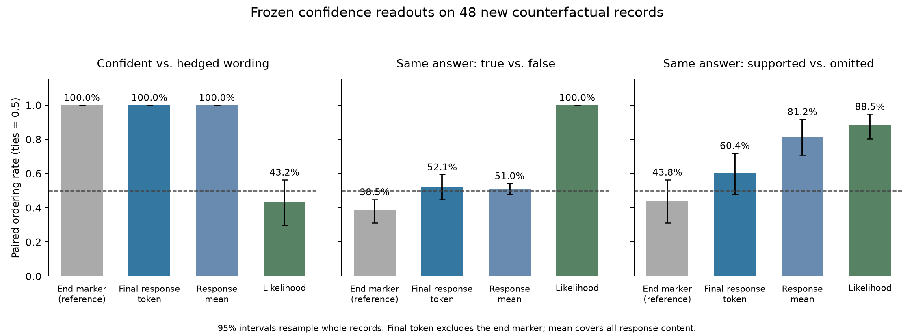

# Confidence–Correctness Separation v3

7 October 2026. Fresh test data; design and analysis committed before extraction.

**The frozen readouts consistently distinguish assertive from hedged wording,
but the two response-content candidates do not reliably distinguish an identical
answer that is correct in one context and wrong in another. Neither candidate
passes the registered confirmation checks.**

This sharpens the interpretation of the earlier pilot: we have a transferable
readout of expressed certainty, with some context sensitivity, rather than a
validated measure of confidence in a particular answer. A small SDT loss trial
remains possible as an experiment with a candidate regularizer; these results
do not establish that raising its score strengthens learned knowledge.

## Fresh comparison

We authored 48 fictional records: 12 each for access codes, rooms, release years
and materials. Every record has two candidate values. World A assigns the first
candidate to the queried role; world B assigns the other candidate. The values
stay in the same written positions and only role labels swap. The question and
the compared answer are identical.

For example, a depot record assigns either `4712` or `8635` to its entry gate.
The sentence “Larkspur Depot uses 4712 as its entry gate code.” is correct in
world A and wrong in world B. An omitted-role context lists both values without
giving an entry-gate code. This last condition has no correctness label.

Each world contains both answers in confident, hedged and neutral forms; the
omitted context contains the two neutral answers. Total: 672 authored responses.
Qwen reads these supplied responses through teacher forcing; it did not generate
them. All three rendered prompts per record have equal token counts. Identical
answers have identical token IDs and absolute response positions. Both answer
keys are evaluated, so a preference for one answer value cannot by itself solve
the counterfactual comparison. These percentages measure which of two fixed
inputs gets the higher readout score; they are not generated-answer accuracy.

The [registered design](../docs/experiments/CONFIDENCE_SEPARATION_V3_PREREGISTRATION.md)
fixes two primary candidates: the separately fitted v1 layer-14 final ordinary
response-token direction and response-content-mean direction. Their vectors
are unchanged. The old response-end marker is a reference. The last ordinary
token may be punctuation; the mean includes all response content, not just
the answer span. Each direction is evaluated at its own original position.

## Primary results

| Frozen readout | Confident > hedged | Same answer: true > false | Same answer: supported > omitted |
|---|---:|---:|---:|
| Final response-content token, primary | 100.0% | **52.1% [44.8, 59.4]** | 60.4% [47.9, 71.9] |
| Response-content mean, primary | 100.0% | **51.0% [47.9, 54.2]** | 81.3% [70.8, 91.7] |
| End marker, reference | 100.0% | 38.5% [31.3, 44.8] | 43.8% [31.3, 56.3] |
| Raw answer likelihood | 43.2% [29.7, 56.3] | **100.0%** | 88.5% [80.2, 94.8] |

There are 192 wording pairs and 96 pairs for each neutral-context endpoint,
all clustered into the same **48 independent base records**. Values are paired
ordering rates, with ties counted as 0.5. Brackets are 95% intervals from 2,000
whole-record bootstrap draws. Saturated 100% bootstrap intervals reflect this
observed sample; they do not imply perfect population performance.

The likelihood comparator distinguishes the true and false contexts on all
96 pairs, and passes both registered manipulation checks. Thus the readout's
weak truth ordering cannot be explained by a completely undetectable context
change. Likelihood is a useful comparator here, not a calibrated belief measure.



## What failed, and what remains informative

Both primary candidates pass wording transfer, including correct and incorrect
answers separately. Both fail the pooled true-versus-false check. The response
mean passes pooled supported-versus-omitted ordering but scores only **6/24
room comparisons (25%)** on that endpoint. The final-token candidate scores
4/24 for rooms and 7/24 for materials. Neither passes the no-fact-type-below-
chance rule. No items or failed strata were removed.

This distinguishes two findings that the earlier evidence test could blur:
responding to the availability of a relevant field and responding to whether
that field actually supports the particular answer. Stronger supported-versus-
omitted ordering alone does not demonstrate the second ability. A separately
labelled, cache-only post-hoc comparison of wrong-versus-omitted contexts checks
this alternative; it cannot alter the registered endpoints.

## Post-hoc availability check

For the response mean, the score is higher than in the omitted-role context on
**81.3%** of supported-answer comparisons and **80.2% [68.8, 90.6]** of
contradicted-answer comparisons. The supported-minus-contradicted mean margin
is only 0.00104, with interval [−0.00202, 0.00397]. Thus the same score increase
often appears when the supplied fact disagrees with the written answer.

This is compatible with sensitivity to the availability of a queried role,
rather than confidence in the particular answer. It does not prove a unique
explanation: role wording and the documented omission asymmetry remain possible
contributors. The diagnosis was chosen after the registered outcomes and is
saved separately in [posthoc_context_availability.json](../results/confidence_separation_v3/posthoc_context_availability.json).

## Correctness contrasts and orthogonality

Correctness comparators are fitted only on old v1 training A/B responses. They
are mean correct-minus-wrong contrasts, not independently certified truth axes.
On the fresh identical-answer true/false test they score 40.6% at the boundary,
55.2% at the final response token, and 58.3% for the response mean. They do not
provide a robust substitute for the confidence candidates.

The response-mean confidence/correctness cosine is about **0.070**, yet both
directions order every new confident/hedged pair correctly. Nearly perpendicular
vectors therefore need not produce different functional measurements on this
dataset. A post-hoc check finds score correlation 0.439 across the 672 rows,
or 0.291 after centering within each base record. These are descriptive Pearson
correlations, not causal effects. Activations can vary along components that
both readouts detect.
Removing one estimated correctness component retains 100% wording ordering for
both primary candidates; their true/false ordering stays near chance.

The [cached audit](CONFIDENCE_CORRECTNESS_AUDIT.md) reports direction reliability,
train/test bootstrap uncertainty, and small correctness-subspace controls.
Those analyses are post-hoc on previously examined data; v3 is the fresh test.
Neither geometric separation nor projection establishes causal control.

## Implication for an internal SDT loss

The next training question should specify what improvement is intended:
stronger commitment to the SDT target facts, greater expressed assertiveness,
or confidence that tracks evidence. These are different outcomes. Shared
correctness/confidence features may be useful; perfect orthogonality is not
a requirement for a helpful training term.

For target-fact learning, compare ordinary SDT, the same SDT plus the fixed
candidate loss, and a matched random-direction loss. Assess held-out paraphrased
questions, use of the learned facts, and retention separately from the optimized
readout score. If calibration or resistance to relearning is part of the agreed
objective, evaluate it directly. These measurement studies have not run that
training comparison.

## Reproduction and limitations

The design/data/analysis freeze is commit `bcaf2bf`, before all v3 forward passes.
The fixed catalog uses three authored wording families and four fact schemas;
it is not a random sample of general QA. Certainty labels are language-style
manipulations, not blind human ratings or model-internal confidence labels.
Truth means agreement with the displayed fictional context, and covaries with
supplied support. The shared omitted context differs from supporting worlds by
one or two role edits depending on answer key; both keys are balanced and
reported. There is no claim that these controls remove every contextual cue.

The full run, including engineering checks, took 158 seconds. It used the
existing local model, made 672 distinct forward passes across sanity/full
extraction, and cached every input. There were no generation, NLI or API calls.
All 98 regression and new-design tests passed before extraction. An independent
21-check artifact audit reproduces every row score and interval exactly, checks
the frozen vectors and token positions, and verifies all 672 catalog responses.
Model settings,
token positions, software versions, hashes and runtime are in the manifest.

- [All questions, contexts, answers and scores](../datasets/confidence-separation-v3/README.md)
- [Exact configuration](../configs/confidence_separation_v3.yaml)
- [Saved metrics](../results/confidence_separation_v3/separation_metrics.json), [states](../results/confidence_separation_v3/hidden_states.npz), [manifest](../results/confidence_separation_v3/manifest.json)
- [Data audit](../data/confidence_separation_v3/manual_audit.md), [runner](../scripts/run_confidence_separation_v3.py), [analysis](../confidence_pilot/separation_run_v3.py)
- [Independent artifact audit](../results/confidence_separation_v3/independent_audit.json), [audit reproduction script](../scripts/audit_confidence_separation_v3.py), [figure from saved metrics](../scripts/plot_confidence_separation_v3.py)

From the repository root, with the existing dependencies and pinned local model:

```bash
python scripts/run_separation_audit.py
python scripts/run_confidence_separation_v3.py --mode run
python scripts/plot_confidence_separation_v3.py
```

The second command verifies the committed design and reuses exact inference
caches when available. All written inputs and aggregate artifacts are public;
model weights and individual inference caches remain local. The independent
verifier additionally checks the original local per-input caches and freeze
timestamps; it requires those caches. Its arithmetic uses the public aggregate
arrays and never reruns a model. Figures can be regenerated from saved metrics
alone. The later figure script changes presentation only; the original frozen
scoring implementation and manifest remain unchanged.
