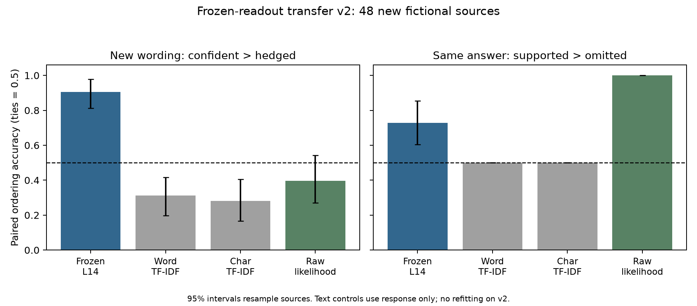

# Frozen Transfer v2 — Expressed-Certainty Evidence-Transfer Test

7 October 2026. Completed under the [registered design](../CONFIDENCE_TRANSFER_PREREGISTRATION_V2.md).

## Conclusion

**The frozen v1 readout transfers to new certainty wording, and shows a pooled
association with supplied evidence. It fails the preregistered robustness
check, so the boundary-token readout is not ready to become an SDT loss.**

It correctly orders 87/96 new wording pairs (90.6%) and 35/48 identical-answer
QA evidence pairs (72.9%). The evidence result reverses for release years:
only 4/12 supported contexts score above their omitted counterparts. The design
required no fact type to fall below chance. This failure is retained, not
replaced by a better-performing secondary token position.

The research can continue. The useful next step is an independent confirmation
of the response-content candidates, not training with the present boundary
direction. These are measurement results, not evidence that an internal loss
improves knowledge, confidence calibration, or synthetic-document learning.

## What was tested

Qwen2.5-1.5B-Instruct and the v1 directions were frozen. We constructed 48 new
fictional records, 12 each for access codes, assigned rooms, release years and
materials. Each record yields ten written responses, for 480 rows overall.
No v2 row was used to fit a readout, choose its sign, or select a layer.

| Required test | What changes | What stays fixed |
|---|---|---|
| Natural wording, 96 pairs | Assertion versus hedge, across 12 new wording types | Source, prompt, answer proposition and correctness |
| Neutral QA evidence, 48 pairs | Target fact supplied versus target role omitted | World truth, answer text/token IDs, full prompt length and assistant token positions |

Omitted contexts retain both candidate values under different field names; the
queried role is absent. This tests **supplied-context sufficiency**, not a
ground-truth label for subjective confidence. Supported/conflicting contexts
and factual-document requests are secondary checks. All sources are test-only.

The [scoreless audit](../data/confidence_transfer_v2/manual_audit.md) was saved
before extraction. It records all world keys, contexts and wording pairs.
Response-length controls include 48 pairs with the assertion longer than the
hedge and eight matched exactly in tokens, words and characters.

## How the readout is calculated

Paired Confidence v1—not either Stage 0 semantic-uncertainty probe—estimates a
source-equal mean activation difference
on its 72 training sources, using only rewrite families A/B:

$$
d=\frac{1}{72}\sum_q\operatorname{mean}_{c,f}
\left(h^{\mathrm{confident}}_{q,c,f}-h^{\mathrm{hedged}}_{q,c,f}\right),
\qquad v=\frac{d}{\lVert d\rVert_2}.
$$

Here $c$ indexes correct/wrong answer content and $f$ indexes the two training
rewrite families. **V2 uses that saved $v$ unchanged**, with score
$s(h)=v^\top h$. This is a linear readout, not a probability or a new v2 model.

The model consumes the complete written response through teacher forcing.
The primary state is `hidden_states[14]` at the assistant `<|im_end|>` token
(ID 151645), after the answer. Index 0 is the embedding state, so index 14 is
the state after block 14. It is neither the final question token nor the final
ordinary word; both other positions are cached separately.

For each pair, a positive score difference gets 1, a reversal 0, and a tie 0.5.
Average within source, then across sources. The 95% intervals resample source
bundles 2,000 times, preserving both correctness pairs together. They do not
measure generalization across arbitrary wording families.

## Required outcomes and controls

| Method | New wording: confident > hedged | Neutral QA: supported > omitted |
|---|---:|---:|
| **Frozen layer-14 boundary readout** | **90.6% [81.3, 97.9]** | **72.9% [60.4, 85.4]** |
| V1-fitted word/bigram TF-IDF | 31.3% [19.8, 41.7] | 50.0%, all ties |
| V1-fitted character TF-IDF | 28.1% [16.7, 40.6] | 50.0%, all ties |
| Raw negative mean-token NLL | 39.6% [27.1, 54.2] | 100.0%, 48/48 |
| Raw token length, larger first | 54.2% [40.6, 67.7] | 50.0%, all ties |

Brackets contain source-bootstrap intervals. TF-IDF is a response-text
classifier fitted only on the old v1 training A/B responses; no v2 vocabulary
or label enters fitting. Identical neutral responses must tie for these
response-only controls. Their weak wording transfer does not rule out all
lexical or stylistic shortcuts in the activation readout.

NLL (negative log likelihood) measures how surprising the fixed response tokens
are to the model. Lower NLL means a more likely response. The raw likelihood
check correctly orders all 48 evidence pairs, passing the manipulation gate:
the context change was detectable. Its saturated bootstrap interval is not a
population guarantee of perfect performance. Sequence NLL gives the same
ordering here; the reconstructed v1 NLL classifiers also score 100% on evidence.

This figure shows pooled results. **The pooled evidence score does not override
the failed release-year check below.**

## Failure analysis

| Fact type | Wording orderings | Neutral QA evidence orderings |
|---|---:|---:|
| Access code | 22/24, 91.7% | 8/12, 66.7% |
| Assigned room | 22/24, 91.7% | 12/12, 100.0% |
| Release year | 21/24, 87.5% | **4/12, 33.3%** |
| Material | 22/24, 91.7% | 11/12, 91.7% |

Natural wording passes all registered checks. Correct answers score 43/48
(89.6%) and wrong answers 44/48 (91.7%); this confirms that the readout can score
assertions highly even when their content is wrong. All eight N08 wording pairs
reverse; one N10 pair also reverses. No failures were excluded. Assertions
longer than hedges score 81.3% on 48 pairs, and the 24 pairs matched within one
token score 100%, so a single length ordering does not explain every success.
These are authored certainty labels, not blind human annotations; some answer
framing can be pragmatically ambiguous. We retain the N08 failures rather than
relabeling them after seeing scores.

Neutral QA exceeds the pooled 65% threshold and its interval lies above 50%,
but **fails the no-fact-type-below-chance rule**. This is a completed negative
robustness result, not an inconclusive manipulation. Document-format evidence
ordering is 75.0%; supported-versus-conflicting ordering is 64.6% in QA and
58.3% in document format. These secondary results cannot rescue the primary gate.

The evidence mean score difference is 0.060, versus 1.595 for wording changes.
Removing the one v1-estimated correctness direction leaves wording at 90.6%
but evidence at 50.0%. This suggests the pooled evidence effect overlaps that
estimated correctness component; it does not establish independence, a causal
confidence mechanism, or removal of all correctness information.

Null controls remain broad. Of 200 frozen source-sign-shuffled directions,
44 match or exceed the wording result and 38 match or exceed the evidence
result; for 200 antipodal random directions the counts are 9 and 26. Ensemble
means are near 50%, but strong individual controls remain possible. These are
descriptive comparisons, **not permutation p-values**.

## Secondary candidates and the next decision

Each position below uses its own saved v1 direction, not the boundary direction
applied at a new token. No position was refitted on these outcomes.

| Frozen representation | Natural wording | Neutral QA evidence |
|---|---:|---:|
| Layer 14, final ordinary content token | 86.5% | 93.8% |
| Layer 14, response-only mean | 100.0% | 93.8% |
| Layer 23, response boundary | 74.0% | 81.3% |

Content-token and response-mean candidates each improve pooled evidence
ordering by 20.8 percentage points versus the primary boundary score
(paired source-bootstrap interval: 8.3 to 33.3 points). Both avoid a below-chance
fact type in this dataset. They are **candidates for a new confirmation**, not
substitutes for the failed registered boundary endpoint.

The next experiment should fix these candidates and test fresh records with
varied field names, additional same-proposition wording controls and unchanged
answer-token comparisons. Keep raw likelihood as a comparator. A candidate
must survive those checks before a small causal or training experiment asks
whether increasing its score improves the intended behavior rather than just
rewarding assertive responses. The eventual SDT experiment still needs an
accuracy objective and held-out accuracy/calibration checks alongside any
auxiliary activation loss.

## Reproducibility

The design/data commit is `71c696d`; the final analysis was frozen at `54121d9`
before full evaluation. The unchanged v1 primary-direction file is SHA-256
pinned in the [configuration](../configs/paired_confidence_transfer_v2.yaml).
The exact model snapshot, dtype, device, layers, seeds, software versions,
implementation hashes and artifact hashes are recorded in the
[manifest](../results/paired_confidence_transfer_v2/manifest.json).

All 69 regression tests, all extraction/cache-resume gates and 27 independent
saved-artifact audit checks pass. This confirms pipeline integrity, not a pass
of the statistical robustness gate. Hidden
states are aligned to 480 row IDs with shape `[480, 2, 4, 1536]`. Four-source
sanity used 40 forwards; full extraction reused them and made 440 new forwards.
The full command took 83.2 seconds after the initial sanity run. No generation,
NLI inference, external API inference, steering or training was performed.

See the [execution runbook](../docs/experiments/CONFIDENCE_TRANSFER_README_V2.md) and
[saved metrics](../results/paired_confidence_transfer_v2/transfer_metrics.json).
Model weights and per-input resumable caches stay local; aggregate states,
data, readouts and controls are checked in. The independent saved-artifact
audit is in [`independent_audit.json`](../results/paired_confidence_transfer_v2/independent_audit.json).
