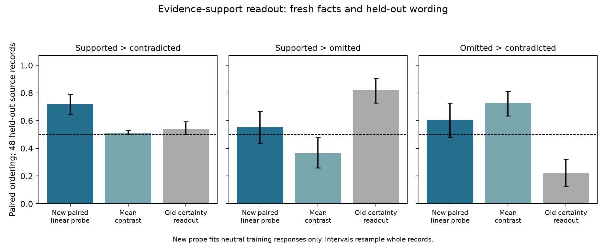

# Evidence-Sensitive Readout v4

8 October 2026. Registered measurement pilot; model parameters remained frozen.

**A new linear probe detects support for an identical answer on fresh records:
71.9% ordering accuracy, or 69/96 comparisons [64.6%, 79.2%]. This ordering
also survives confident and hedged wording.** The old expressed-certainty
directions remain near chance on the same comparison.

**This is a useful evidence-support signal, but it is not yet a validated
confidence measure.** The probe does not reliably place missing evidence
between support and contradiction. Independent behavioral validation also
fails the registered centered-correlation and candidate-coverage checks.
The whole-study validation gate therefore fails, and training stays deferred.

The result advances the measurement question: answer support is more accessible
when it is the training target, while missing evidence and independently
elicited answers expose the limits of treating that readout as confidence.

## Data and token position

We constructed **168 new fictional records** across access codes, assigned
rooms, release years and materials: 96 train, 24 validation and 48 test.
Entity identities, candidate values and context/question/neutral-response
templates are disjoint across splits: T1 train, T2 validation, T3/T4 test.
Validation was diagnostic only; it did not select a layer, sign or penalty.

Each record lists two values at fixed locations. The queried role is assigned
to A, assigned to B, or omitted while both values remain. Both neutral answers
appear in all worlds: 1,008 responses. Test records add confident and hedged
variants: 576 responses, for **1,584 supplied responses** overall. Omission has
**no correctness label**; lacking evidence does not make an answer false.

For each fixed answer and style, response IDs, prompt length and absolute
response/answer-token positions match across worlds. Candidate values also
keep identical context-relative token locations. Omission changes two role
labels from either supporting world, avoiding v3's asymmetry. All rows remain.

The primary state is **the mean of every ordinary response-content token state
at layer 14**, excluding the end marker. It includes the full supplied answer
sentence, not the question's last token or just the answer span. Layer 14 means
`hidden_states[14]`, after transformer block 14. Qwen reads these answers
through teacher forcing; independent generation is a separate test below.

## Fitting

For each training record and candidate, form the same-answer contrast:

```math
\Delta h_{q,a}=h^{\mathrm{supported}}_{q,a}-h^{\mathrm{contradicted}}_{q,a}.
```

Fit L2 logistic regression to 192 training contrasts and their sign-reversed
copies, with no intercept, C=0.01 and training-only feature scaling. Convert
coefficients back to raw-state coordinates and unit-normalize:

```math
s(h)=v^\top h.
```

This is **a newly fitted support readout**, not the frozen v1 certainty vector.
Omission, styled responses and behavioral outputs never fit it. The score
orders support; the sigmoid is not the model's probability of correctness.

## Registered results

| Same-answer comparison | Ordering rate [95% interval] | Outcome |
|---|---:|---|
| Neutral: supported > contradicted | **71.9% [64.6, 79.2]** | Pass |
| Neutral: supported > omitted | 55.2% [43.8, 66.7] | Fail |
| Neutral: omitted > contradicted | 60.4% [47.9, 72.9] | Fail |
| Confident: supported > contradicted | **71.9% [64.6, 78.1]** | Pass |
| Hedged: supported > contradicted | **71.9% [64.6, 79.2]** | Pass |

Each endpoint has 96 comparisons within **48 independent test records**.
Positive margins count as 1, reversals as 0 and ties as 0.5; intervals use
2,000 whole-record bootstrap draws. These are score-ordering rates, not
generated-answer accuracy. Neutral gates require at least 65%, a lower bound
above 50% and no fact schema below chance.

| Fact schema | Supported > contradicted | Supported > omitted | Omitted > contradicted |
|---|---:|---:|---:|
| Access codes | 83.3% | 50.0% | 54.2% |
| Rooms | 54.2% | 75.0% | 50.0% |
| Release years | 79.2% | 83.3% | **37.5%** |
| Materials | 70.8% | **12.5%** | 100.0% |

There are 12 independent records per schema, with 24 comparisons per endpoint.
Rooms remain weak on support-versus-contradiction. Neutral support ordering
is 81.3% on T3 and 62.5% on T4; it is 77.1% for answer A and 66.7% for B.
Supported-versus-omitted is 81.3% on T3 but 29.2% on T4. Omitted-versus-
contradicted reverses that pattern, at 29.2% and 91.7%. All failed strata
remain in the saved results; none was removed or used to tune the probe.

## Controls and residual wording effects

| Method | Neutral supported > contradicted |
|---|---:|
| New response-mean logistic probe, primary | **71.9%** |
| New final-content-token logistic probe, secondary | 78.1% |
| New response-mean simple mean contrast, secondary | 51.0% |
| Old frozen expressed-certainty response mean | 54.2% |
| Old frozen expressed-certainty final content token | 51.0% |
| Prompt-only, constant and response-length controls | 50.0% |
| Same-answer likelihood | **100.0%** |

The primary exceeds the **61.5% 95th-percentile cutoff** from 200
source-bundled shuffled-label refits; their mean is 48.2%. Two hundred random
unit directions average 50.0%, with a 54.2% 95th percentile. These conditional
control distributions are not permutation p-values. The secondary final-token
result cannot replace the failed primary validation gate.

Likelihood passes the manipulation check: the evidence changes are detectable.
Its saturated ordering on this controlled sample does not establish calibration.

**Preserved evidence ordering does not mean immunity to wording.** The new
probe's largest absolute style shift is 0.658 test-neutral-score standard
deviations, versus a 0.132-standard-deviation mean evidence shift: about five
times larger. Absolute scores still respond to assertive versus tentative
language, although paired context ordering survives both styles. These are
registered descriptive diagnostics, not an added pass criterion.



## Independent model behavior

Different question paraphrases give **144 prompts**: one per test record/world.
They request a bare value and permit `unknown`. We score both complete
candidate sequences and generate one unconstrained greedy answer, with at most
12 new tokens. These outputs do not enter probe fitting or feature selection.

| Behavioral check | Result | Registered outcome |
|---|---:|---|
| Probe candidate margin versus candidate log odds, Spearman correlation | **0.450 [0.318, 0.591]** | Pass |
| Correlation centered within evidence-world × fact-schema groups | 0.205 [−0.016, 0.384] | Fail |
| Known-world correctness, explicit candidate parsing | 67/96: **69.8% [60.4, 79.2]** | Pass |
| Known-world candidate coverage | 69/96: 71.9% [62.5, 81.3] | Fail; required 75% |
| Known-world strict exact-value correctness | 63/96: 65.6% [56.3, 75.0] | Diagnostic |
| Omitted-world exact `unknown` responses | 40/48: **83.3% [72.9, 93.8]** | Diagnostic |

The overall correlation is encouraging, but the centered interval includes
zero. Association beyond broad condition/schema differences is not confirmed.
Within-world correlations are 0.393 for A, −0.087 for B and 0.278 for omission;
B and omission intervals include zero.

The registered parser recognizes one explicit candidate mention and retains
unknown, other, ambiguous and negated outputs. Four parsed-correct answers
have prefixes such as `release year: 3172`; exact matching counts these as
format failures. Both measures are exposed rather than substituting the more
favorable one. Known worlds have 27 noncandidate outputs: 10 unknown and 17
other, including literal field names such as `seminar room` and `shell material`.
Three access-code generations hit the 12-token limit while restating the
question. Thus the behavioral interface contributes to the inconclusive
validation; outputs were neither reclassified nor rerun after inspection.

Omitted worlds yield 40 unknown answers, 6 A and 2 B. Candidate log odds omit
probability mass on unknown/other responses and cannot establish calibration.
Probe-choice agreement is 77.4% on covered cases, averaging sources equally,
but 38.9% when every output is retained. Covered-only agreement does not rescue
the failed behavioral gate. All answer text is available in the collection.

## Interpretation and next step

**The positive result is controlled transfer of an answer-support readout.**
Fresh source/template splits, fixed answers, null controls and the old-certainty
comparison show why this goes beyond identifying confident wording. It does
not establish independent confidence/correctness mechanisms or causal control.

**The confidence interpretation remains unvalidated.** Missing-evidence
ordering, residual wording sensitivity and incomplete behavioral alignment
prevent the stronger claim. A higher score is not yet a justified proxy for
stronger learned knowledge or a validated training objective.

Before the next fresh test, use training-only engineering examples to make
field-to-value mapping unambiguous and set a sufficient generation limit.
Counterbalance behavior wording independently of candidate order. Then test
graded or conflicting evidence, align the score with actual candidate/unknown
behavior, and add natural or generated-answer transfer. Do not enlarge or
retune the observed v4 test set. The
[internal-loss training proposal](../docs/experiments/NEXT_EXPERIMENT.md)
remains deferred until the measurement is assessed on those new tests.

## Reproduction and limits

The protocol, catalog and implementation were frozen at commit
`df5497acf67728a1b03133aa7762bd72e6d64177` before inference. The run took
675.25 seconds, about 11.3 minutes, using the existing local unquantized pinned
Qwen snapshot. It evaluated 1,584 supplied responses and 144 generation
prompts. No NLI, external model API, language-model fine-tuning or activation
intervention was used. The final regression suite passed **133 tests**. The independent
artifact audit passes **58 checks**, reproduces 46,762 numerical values with
zero difference, verifies local caches and confirms 38 earlier files unchanged.

The data are simple numbered fictional codes, suites, years and material
mixtures, with four authored context families. Candidate A is numerically
lower than B. T3/T4 extraction templates each balance candidate order, but
behavior B1/B2 is coupled to order: B1 uses A then B, B2 B then A. Behavioral
wording and order effects cannot be separated here. Support covaries with
correctness relative to the displayed record; it does not measure facts
stored in model parameters.

- [All inputs, supplied answers, scores and generated outputs](../datasets/evidence-confidence-v4/README.md)
- [Registered design](../docs/experiments/EVIDENCE_CONFIDENCE_V4_PREREGISTRATION.md)
- [Exact configuration](../configs/evidence_confidence_v4.yaml)
- [Saved metrics](../results/evidence_confidence_v4/metrics.json), [states](../results/evidence_confidence_v4/hidden_states.npz), [readouts](../results/evidence_confidence_v4/readout_directions.npz), [manifest](../results/evidence_confidence_v4/manifest.json)
- [Independent artifact audit](../results/evidence_confidence_v4/independent_audit.json)
- [Runbook](../docs/experiments/EVIDENCE_CONFIDENCE_README_V4.md), [runner](../scripts/run_evidence_confidence_v4.py), [analysis](../confidence_pilot/evidence_analysis_v4.py)
